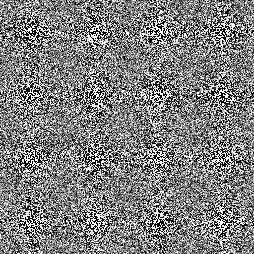
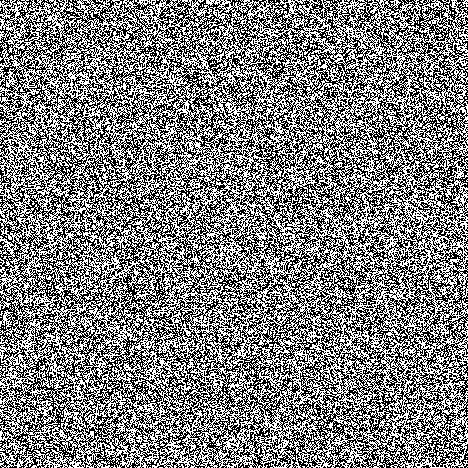
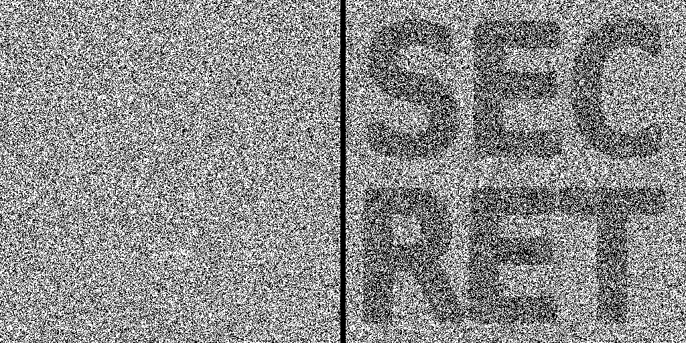

# Bin Ocular

[Bin Ocular](https://sherlockdoyle.github.io/bin-ocular) is a project that employs a form of steganography to conceal images within other images. Specifically, it hides a shape (a black shape on a white background) within two or more noise images. The project is built using Lit and Web Components. The concept was conceived approximately a year ago for a special purpose.

## Instructions for Use

The 'encoding' process can be performed online at: https://sherlockdoyle.github.io/bin-ocular.

To run the project on your local machine, follow these steps:

1. Install the required packages using the command `npm install`.
2. Launch the application with the command `npm run dev`.

## The Algorithm

### Image Specifications

It is important to note that this algorithm only works with black and white images. This simplifies the process as all images consist solely of black and white pixels, without any grey levels. While the algorithm could potentially be extended to support color images, this is left as an exercise for the reader.

For the purposes of this documentation, we will 'encode' a specific image with noise.

## The Process

The process begins by creating a noise image of the same size as our original image.

Each pixel of the image is either black or white. It is crucial to ensure that the distribution of colors is 50-50. The implications of a non-equal distribution will be discussed later.

Next, we conditionally flip some of the pixels of the noise image. We superimpose the noise image over our original image and flip the pixels that fall under the shape of our original image.

The image still appears as random as before, but some of the pixels have been flipped. These are our two final images.

### Decoding

To decode the image, we superimpose the two noise images. There are several possible operations we could perform, such as finding the difference, multiplying (assuming that white is 1 and black is 0), or even XOR. Alternatively, we could perform a simple equality check. Since the two images differ at some pixels, this will reveal the original image.

### Issues with Non-Equal Distributions

If the distributions are not 50-50, the second noise image will appear unusual. For instance, if the noise image has 60% white and 40% black, the inverted area will have 40% white and 60% black. This will clearly reveal the original image.

### Additional Images

The same approach can be used to generate more images. The online application can generate up to 5 images. You can modify the code to change this. The details for generating additional images will not be discussed here, but you can examine the code for more information.

### Physical Overlapping of Images

An interesting aspect of this project is that the noise images can be physically overlapped. To do this, the noise images can be printed on clear plastic. Before printing, the white part should be made transparent. The images need to be aligned exactly to reveal the hidden shape.
